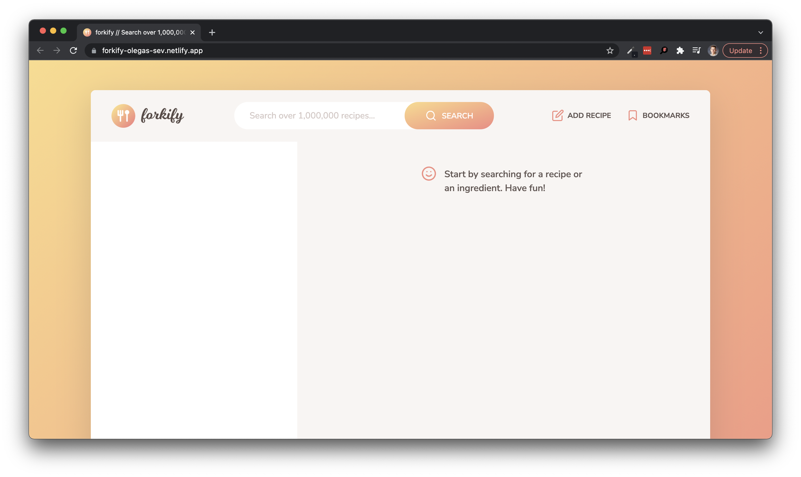

# Forkify web application

<a href="https://forkify-olegas-sev.netlify.app/" target="_blank">
  

    
  

</a>

  <strong>A recipe app for searching recipes 👩‍🍳</strong>

<h3 align="center">
  <a href="https://forkify-v2.netlify.app/" target="_blank">
  API
  </a>
   · 
  <a href="https://forkify-olegas-sev.netlify.app/" target="_blank">
  Live Demo
  </a>
   · 
  <a href="https://www.udemy.com/course/the-complete-javascript-course/" target="_blank">
  Built during course
  </a>
</h3>

---

## Architecture

Built on MVC software design pattern
<a href="forkify-architecture-recipe-loading.png" target="_blank">

  

    
  

</a>
